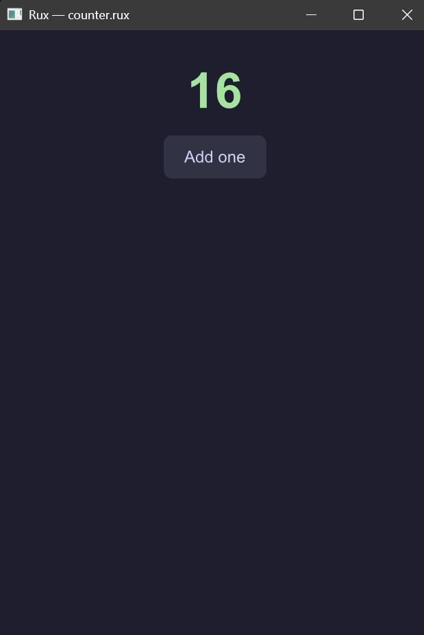

<h1 align="center">
  
</h1>

<p align="center">
  A pure-Rust, web-flavored UI language that renders natively on the GPU — no browser, no webview.
</p>

---

You write a single `.rux` file with familiar `<template>` / `<style>` / `<script>` sections and **literal CSS**. Rux lays it out with a real flexbox/grid engine and paints it in a native window — and reloads live as you edit.

```rux
<template>
    <screen class="app">
        <text class="count">{{ n }}</text>
        <button class="btn" @tap="n = n + 1">
            <text>Add one</text>
        </button>
    </screen>
</template>

<style>
    .app { 
        display: flex; 
        flex-direction: column; 
        align-items: center; 
        gap: 16px; 
        padding: 32px; 
        background: #1e1e2e; 
    }
    .count { color: #a6e3a1; font-size: 48px; font-weight: 700; }
    .btn { 
        padding: 12px 20px; 
        background: #313244; 
        border-radius: 8px;
        color: #cdd6f4; 
        cursor: pointer; 
    }
</style>

<script>
  let n = signal(0);
</script>
```

<p align="center">
  
</p>

<p align="center">
  <strong><a href="https://ruxlang.dev">rux website</a></strong>
  · <a href="https://ruxlang.dev/why/">why Rux?</a>
  · <a href="https://ruxlang.dev/blog/">release blog</a>
</p>

## Run it

```bash
# from a clone of this repo
cargo run -p rux-cli -- examples/form.rux
```

The examples — `form`, `list`, `gallery`, `dashboard`, `battery` — cover inputs, scrolling, images, a responsive grid, and a fixed-width card. Edit any of them with the window open and it hot-reloads.

## Editor support (VS Code)

A `.rux` VS Code extension ships in this repo — **syntax highlighting** for all three sections, **snippets**, **folding**, a basic **Format Document** re-indenter (`Shift+Alt+F`), and a **file icon**. Install the prebuilt package (no build step):

```bash
code --install-extension editors/vscode/rux-0.1.0.vsix
```

Then open any `.rux` file. Details and the tooling roadmap (a parser-backed `rux fmt`, `rux check` diagnostics, and a language server are next) are in [`editors/vscode/README.md`](editors/vscode/README.md). The same highlighting powers the ` ```rux ` code blocks on the [website](https://ruxlang.dev).

## What works today

Flexbox **and** CSS grid layout (via [`taffy`]) · the full box model · sizing in `px` / `%` / `rem` / `vw` / `vh` · `minmax(0, 1fr)` grid tracks · gradients, `box-shadow`, `transform`, per-corner radius · fonts + text shaping (via [`parley`]) · text `<input>` with a real caret, **selection and clipboard** · `select` / `textarea` · checkbox / radio · **keyboard focus + Tab** · **scrolling with scrollbars, drag, keyboard, and horizontal** · images · opacity · HiDPI · signals driving `{{ }}` bindings and `r-for` / `r-if` / `r-model` · live hot-reload.

See [`docs/05-as-built.md`](docs/05-as-built.md) for the exact honored-CSS set and [`docs/06-roadmap.md`](docs/06-roadmap.md) for what's next.

## Why another UI language?

Rux is a bet on one specific combination that nothing else quite lands:

> **The web's authoring ergonomics — literal CSS, a handful of HTML-like elements — but pure Rust, GPU-native, with no JavaScript and no new DSL.**

The guiding rule (Law 1) is that **layout never appears in markup**. There is no `<Column>`, `<Padding>`, `<Center>`, or `<Spacer>` — those are `display: flex`, `padding`, `justify-content`, `gap` on a `<view>`. That single rule is what kills the wrapper-nesting ceremony that keeps people off native UI.

| | authoring model | language | renderer |
|---|---|---|---|
| **Rux** | **literal CSS + 6 elements** | **Rust** | **own, GPU ([vello])** |
| Flutter | widget-tree (layout *is* nested widgets) | Dart | own, GPU |
| React Native | React component tree → native widgets | JS/TS | platform widgets + JS bridge |
| Slint | its own `.slint` DSL (QML-like) | Rust/C++/JS | own, GPU/software |
| Lynx | web-like, multi-framework | JS | own |

If you want to ship a production app today, those mature engines are the right call. Rux exists to explore whether the *CSS-authored, Rust-native, no-DSL, no-JS* corner is a nicer place to build — and it's early (`0.x`, expect rough edges). The full argument is in [`docs/01-rationale.md`](docs/01-rationale.md).

## Documentation

- [`01-rationale.md`](docs/01-rationale.md) — why Rux is shaped this way (the four laws)
- [`02-spec.md`](docs/02-spec.md) — the language spec
- [`03-guide.md`](docs/03-guide.md) — a walkthrough guide
- [`04-architecture.md`](docs/04-architecture.md) — how the runtime is built
- [`05-as-built.md`](docs/05-as-built.md) — **what actually works today** (authoritative)
- [`06-roadmap.md`](docs/06-roadmap.md) — what's next

> **Note:** docs 01–04 describe the original design *intent* and have drifted from the code in places. Where they disagree, [`05-as-built.md`](docs/05-as-built.md) wins.

## License

MIT — see [LICENSE](LICENSE).

[`taffy`]: https://github.com/DioxusLabs/taffy
[`parley`]: https://github.com/linebender/parley
[vello]: https://github.com/linebender/vello
